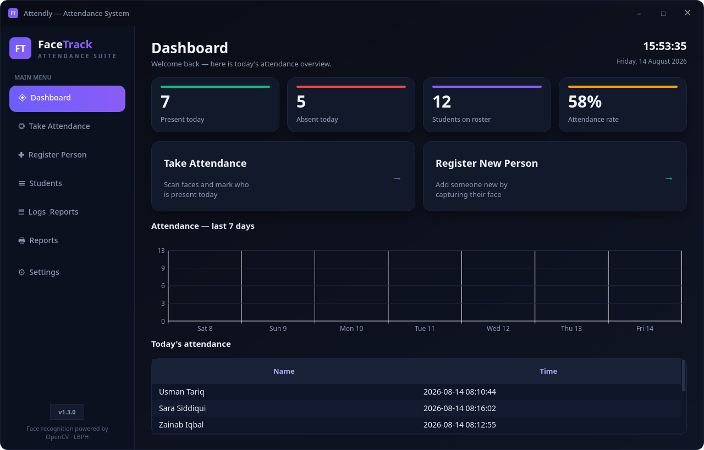
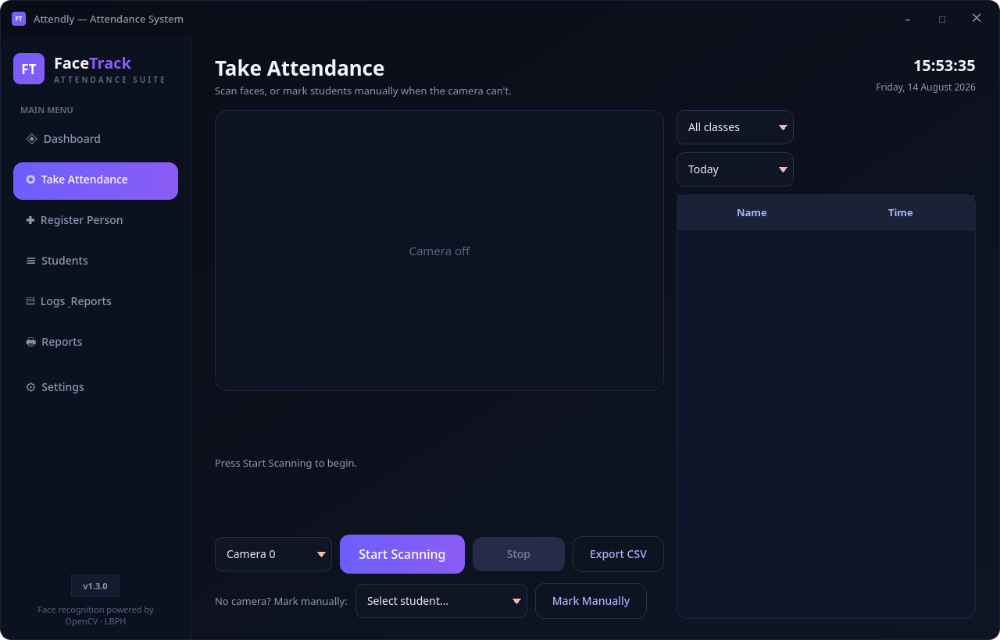
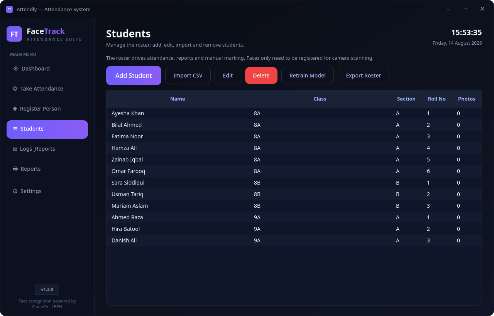
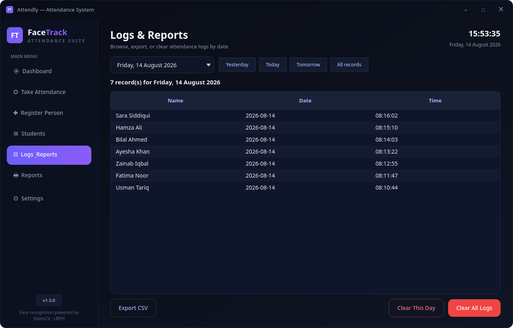
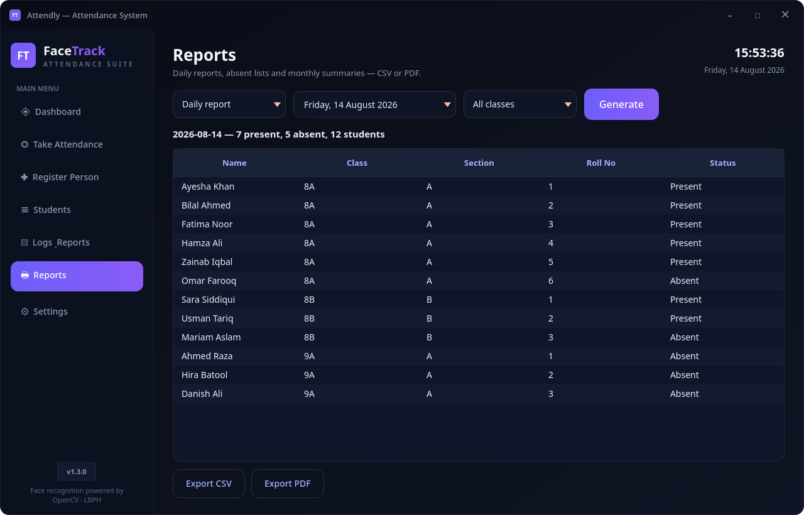
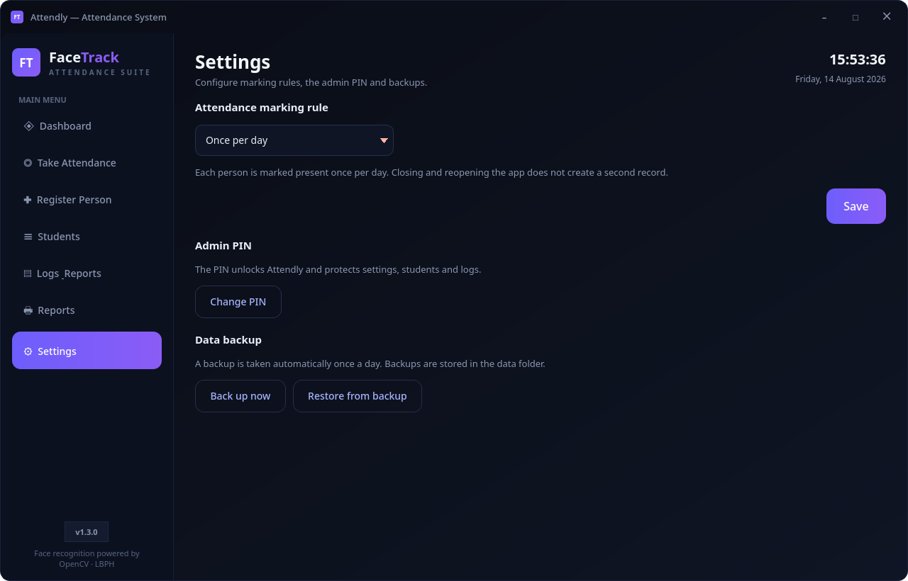
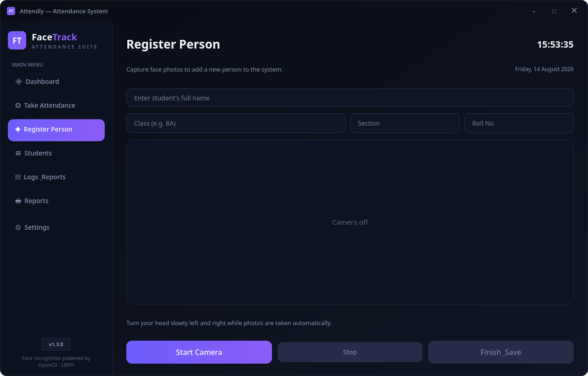

# Attendly — Smart Attendance System

A sellable-grade desktop attendance system for schools, colleges and
workplaces. People register once by capturing their face from several
angles; from then on, attendance is marked automatically the moment the
camera recognizes them — with a one-click manual fallback when the camera
cannot.

Built with **PySide6** (GUI), **OpenCV** (camera, face detection, LBPH
recognition), **NumPy** and **SQLite** (attendance log).



---

## Download

Pre-built, dependency-free binaries — no Python installation needed. Just
download, double-click, done. Both builds are created by the same
PyInstaller pipeline, so behavior is identical.

| Platform | File | How to get it |
|---|---|---|
| **Linux** | `Attendly-Linux-x86_64` | Built locally from this repo, or from a GitHub release once you push and tag the repo |
| **Windows** | `Attendly-Windows-x86_64` | Build with `build\build_windows.bat` on a Windows PC, or from a GitHub release |

The fastest path is GitHub Releases: push this repo to GitHub and create a
release with a tag like `v1.0.0`. The included
`.github/workflows/build.yml` automatically builds both the Linux and
Windows binaries and attaches them to the release:

```
https://github.com/UsmanHarooni/attendly/releases
```

No GitHub yet? Build locally instead:

- **Windows:** install Python 3.10+ from python.org, then double-click
  `build\build_windows.bat` — it creates a venv, installs dependencies and
  produces `dist\Attendly.exe`.
- **Linux:** run `./build/build_linux.sh` (requires bash and Python 3.10+).
  It produces the single-file executable `dist/Attendly`.

First launch: the app creates its own `data/` folder next to the executable
and stores everything there — you can carry that folder with the app to
another machine and your students and logs come along.

---

## What it does

Attendly replaces the paper register. The teacher keeps the app open on a
desk PC or laptop with a webcam. Students walk past, the camera
recognizes them by face, and their name and time are logged. At the end of
the day, the teacher opens Reports and exports the attendance sheet to PDF
for the office — no transcription, no arguments about who was late.

A few scenarios it covers:

- **No camera on the register PC?** Use *Mark Manually* — every unmarked
  student is listed; click and it's logged.
- **Face not recognized (new haircut, glasses, bad lighting)?** Same manual
  fallback, or improve registration photos.
- **School with multiple classes?** Students carry Class/Section/Roll No.
  Scanning, the dashboard, logs and reports can all be filtered by class.
- **Lost data?** Automatic daily backups plus manual backup/restore in
  Settings.

---

## Features

### Face recognition attendance
When scanning is active, each frame is checked for a face. Recognized
people are marked present automatically with the timestamp of recognition.
Recognition runs fully offline on local hardware — no internet connection,
no cloud account, no per-student fees. The default confidence threshold
makes matching strict enough to reject impostors but tolerant of everyday
variation.

### Registration
Register a person by typing their name and turning their head slowly
toward the camera. The app captures ~15 face crops from different angles,
which teaches the recognizer what they look like from multiple directions.
The crops are stored per person under `data/faces/<name>/` so the model
can be retrained after adding or removing anyone.

### Student roster
A full roster with Name, Class, Section and Roll No:
- Add, edit and delete students (photos follow the student record)
- Bulk-import from a CSV file with header `Name,Class,Section,Roll` —
  duplicates are skipped, the roster is deduplicated by name
- Export the roster back to CSV at any time
- Every student sees their face-photo count in the table so the teacher
  knows who still needs registration photos

### Class-aware workflow
Classes are read from the roster automatically. The attendance scanner,
dashboard statistics, logs and reports can all be restricted to one class
— essential when two classes share the same machine.

### Manual marking fallback
The "unmarked today" list shows every student who has not been logged yet
for the chosen date/class. One click marks them present. This is the
safety net for camera failures, and the fastest way to backfill attendance
when students are registered mid-day.

### Reports
- **Daily report** — every student with Present/Absent status and time
- **Absent list** — only the absentees (handy for calling parents)
- **Monthly summary** — per-student presence count over the selected month
- Every report is filterable by class and exportable to **CSV** (opens in
  Excel) or **PDF** (formatted with headers, ready for the school office)

### Logs
A searchable record of every attendance event. Pick any date (with
yesterday/today/tomorrow shortcuts), browse the entries, and export the
day to CSV. Clear a single day's log or the entire history — each with a
confirmation prompt, because there is no undo.

### Admin PIN
Sensitive areas — Students, Logs and Settings — are always locked behind
the 4-digit admin PIN (default `1234`, changeable in Settings). The PIN is
never stored in plain text: it is saved as a salted SHA-256 hash, so
opening `settings.json` reveals nothing useful. The PIN is asked on every
visit to a protected page; day-to-day pages (Dashboard, Attendance,
Register, Reports) stay friction-free. Wrong PINs are refused with a short
message; there is no lockout timer.

### Backups
- **Automatic:** once per day on launch, the whole `data/` folder is
  copied to `data/backups/<timestamp>/`.
- **Manual:** *Back up now* in Settings.
- **Restore:** pick a backup folder from Settings and it is copied back
  over the current data. Recoverable even if the laptop dies mid-term.

### Dashboard
At a glance: total students, present today, absent today and the
attendance rate, plus a 7-day trend chart (QtCharts) and today's live
attendance table with a class filter. Action cards jump straight to
scanning, registering or the roster.

### Polished desktop UI
Frameless window with a custom title bar (drag to move, minimize,
maximize), branded splash screen on launch, toast notifications for every
action, empty states that guide first-time users, and a consistent dark
design system in one stylesheet — the app is meant to be looked at by
non-technical school staff.

---

## Screenshots

| Take Attendance | Students |
|---|---|
|  |  |

| Logs & Reports | Reports |
|---|---|
|  |  |

| Settings | Register Person |
|---|---|
|  |  |

---

## How it works under the hood

```
┌──────────────┐   camera frames   ┌───────────────────┐   crops    ┌───────────────────┐
│  camera.py   │ ─────────────────▶ │ face_trainer.py   │ ─────────▶ │ data/faces/<name>/│
│ (CameraThread│  (cv2.VideoCapture) │ (detect + predict)│            └─────────┬─────────┘
└──────────────┘                    └────────┬──────────┘                      │ train
                                             │ prediction (name, distance)     ▼
                                             ▼                        ┌───────────────────┐
                                     ┌───────────────┐                 │ data/trainer.yml  │
                                     │ attendance_   │  present?       │ + labels.json     │
                                     │ window.py     │ ──────────────▶ │ (LBPH model)      │
                                     └───────────────┘                 └───────────────────┘
                                            │ mark
                                            ▼
                                     ┌───────────────┐   reads/writes    ┌───────────────────┐
                                     │  reports &    │ ─────────────────▶│ data/attendance.db│
                                     │  dashboard    │                   │ (SQLite)          │
                                     └───────────────┘                   └───────────────────┘
```

1. **Capture** — `camera.py` runs a `CameraThread` that reads frames from
   the webcam without blocking the UI.
2. **Detection** — each frame goes through the OpenCV Haar cascade
   (`haarcascade_frontalface_default.xml`) which finds faces and returns
   bounding boxes.
3. **Recognition** — `face_trainer.py` converts the detected face to the
   same size used in training, extracts its Local Binary Pattern histogram,
   and asks the trained LBPH model for the nearest match plus a distance
   score.
4. **Accept or reject** — a prediction under `CONFIDENCE_THRESHOLD`
   (default 70) is accepted and the person is marked present; above it, the
   face is treated as unknown and ignored.
5. **Logging** — each accepted mark is a row in the SQLite `attendance`
   table: name + timestamp. The marking rule (`daily` or `session`) decides
   whether a person can be logged again on the same day.
6. **Reporting** — SQL queries aggregate the rows into daily reports,
   absent lists and monthly summaries, rendered into the UI or exported to
   CSV/PDF.

The recognizer is intentionally isolated behind `face_trainer.py`, so the
LBPH engine can be swapped for a deep-learning model (FaceNet, ArcFace)
without touching the UI, database or reporting layers.

---

## Getting started

### Run from source

```bash
cd attendly
python3 -m venv venv
venv/bin/pip install -r requirements.txt
venv/bin/python main.py
```

On Windows use `venv\Scripts\activate` and `venv\Scripts\python main.py`.

Default admin PIN: `1234` — change it in **Settings → Admin PIN**.

### Build the standalone executable

```bash
# Linux
./build/build_linux.sh

# Windows (in cmd)
build\build_windows.bat
```

GitHub users can skip both: tag a release and `.github/workflows/build.yml`
produces both binaries automatically.

---

## Typical workflow

1. **Add the roster** — *Students → Add* one by one, or import a CSV:
   `Name,Class,Section,Roll` (first row header). You can edit, delete and
   export from the same screen.
2. **Register faces** — *Register Person*: type the name, pick the class,
   start the camera, look at it and turn the head slowly. Finish & Save
   when ~15 photos are captured. Repeat for every student.
3. **Take attendance** — *Take Attendance*: pick the class if needed,
   start scanning. Recognized students are logged automatically and appear
   in the *Marked today* list. Use *Mark Manually* for anyone the camera
   can't handle.
4. **Check the day** — the Dashboard shows today's stats and a 7-day
   trend. *Logs* shows the raw event list for any date.
5. **Hand over to the office** — *Reports*: generate the daily report or
   absent list, filter by class, export to PDF and print.

---

## Data storage

Everything the app knows lives in one `data/` folder (created
automatically; sits next to the executable in packaged builds):

| File / folder | Contents |
|---|---|
| `data/attendance.db` | SQLite database: `attendance` table (every mark: name + timestamp) and `students` table (name, class, section, roll) |
| `data/faces/<name>/` | Captured face crops for each registered person |
| `data/trainer.yml` | The trained LBPH recognition model |
| `data/labels.json` | Name ↔ model-label mapping |
| `data/settings.json` | Marking rule, admin PIN hash, last-backup date |
| `data/backups/<timestamp>/` | Daily automatic snapshots of the whole folder |
| `data/haarcascade_frontalface_default.xml` | OpenCV face detector (shipped with the app) |

To move the app to another computer, copy the whole `data/` folder. To
reset everything, delete it and start fresh.

---

## Configuration

- **Marking rule** — *Settings → Marking rule*: `daily` (one mark per
  person per day, the default) or `session` (mark again whenever they are
  seen again).
- **Recognition strictness** — `CONFIDENCE_THRESHOLD` (default `70`) in
  `attendance_window.py`. Lower is stricter (fewer false positives, but
  more missed faces); raise it if valid faces are being rejected.
- **Admin PIN** — *Settings → Change PIN* (requires the current PIN).
  Default `1234`.

---

## Project structure

```
main.py               app shell: window, navigation, PIN gate, dashboard, chart, toasts
paths.py              path resolution for source runs vs packaged binaries
theme.py              the entire visual design system (one stylesheet)
branding.py           app icon + splash screen
titlebar.py           custom frameless title bar
widgets.py            nav buttons, stat/action cards, empty states
toast.py              toast notifications
camera.py             webcam capture thread
face_trainer.py       face detection, training and recognition (LBPH)
database.py           SQLite: attendance + students, reports, backups, CSV
settings.py           app settings + hashed admin PIN
pin_dialog.py         PIN prompt + PIN change dialogs
student_dialog.py     add/edit student dialog
manage_window.py      Students page (roster, CSV import/export, retrain)
register_window.py    Register Person page
attendance_window.py  Take Attendance page (scanning + manual marking)
logs_window.py        Logs page (date browser, clear, export)
reports_window.py     Reports page (daily/absent/monthly, CSV/PDF)
settings_window.py    Settings page (PIN, marking rule, backups)
build/                build scripts for Linux and Windows
.github/workflows/    auto-build on GitHub release
screenshots/          images used by this README
```

---

## FAQ

**Does it need internet?** No. Recognition, storage and reporting are fully
local. That also means no monthly fees per student.

**What camera does it need?** Any webcam or integrated laptop camera that
your OS can use. Camera index is fixed to `0` in `camera.py`.

**How accurate is it?** Good, with the standard caveats: even lighting,
face toward the camera, a few registration angles. The confidence
threshold in `attendance_window.py` lets you tune strictness, and the
manual fallback covers every failure case.

**Can two classes use the same install?** Yes — classes filter the
scanner, dashboard, logs and reports.

**What happens if the PC dies?** The daily automatic backups in
`data/backups/` plus manual restore in Settings. Copy `data/` anywhere.

**Can I sell this?** The code is yours. If you do, remove or re-license
the bundled assets as needed and make sure your PySide6/OpenCV usage
complies with their (LGPL/BSD-style) licenses.

---

## Requirements

- Python 3.10+ (developed on 3.14)
- PySide6, OpenCV (`opencv-contrib-python`), NumPy — install via
  `requirements.txt`
- Linux builds need the usual Qt runtime libraries (X11/Wayland); Windows
  builds bundle everything.
